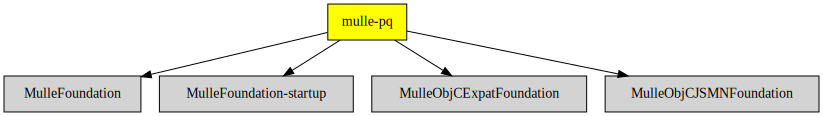

# mulle-plist-convert

#### ⛪️ mulle-plist-convert JSON to plist to XML and back

If [jq](https://stedolan.github.io/jq/) is installed, you can run an arbitrary
**jq** filter over your property list and get the result back in either JSON
or Plist or XML.

| Release Version                                       | Release Notes
|-------------------------------------------------------|--------------
|  [](//github.com/MulleFoundation/mulle-plist-convert/actions)| [RELEASENOTES](RELEASENOTES.md) |


## Usage

```
Usage: mulle-plist-convert [options] ...

   Convert between JSON, Plist, XML format.
   Any arguments after the known options are interpreted to be jq commands.
   jq will be invoked and give then parsed input. The result of the jq
   command then replaces the input and finally output conversion takes place.

   --jq                 : run input plist through jq
   --out-format <value> : output format one of json,xml,(plist)
   --in <value>         : input file (stdin)
   --out <value>        : output file (stdout)
   jq <value>           : ???
```


### You are here



## Add

Use [mulle-sde](//github.com/mulle-sde) to add mulle-plist-convert to your project:

``` sh
mulle-sde add github:MulleFoundation/mulle-plist-convert
```

To only add the sources of mulle-plist-convert with dependency
sources use [clib](https://github.com/clibs/clib):


``` sh
clib install --out src/MulleFoundation MulleFoundation/mulle-plist-convert
```

Add `-isystem src/MulleFoundation` to your `CFLAGS` and compile all the sources that were downloaded with your project.


## Install

### Install with mulle-sde

Use [mulle-sde](//github.com/mulle-sde) to build and install mulle-plist-convert and all dependencies:

``` sh
mulle-sde install --prefix /usr/local \
   https://github.com/MulleFoundation/mulle-plist-convert/archive/latest.tar.gz
```

### Manual Installation

Install the requirements:

| Requirements                                 | Description
|----------------------------------------------|-----------------------
| [MulleFoundation](https://github.com/MulleFoundation/MulleFoundation)             | 💍 Umbrella library for the MulleFoundation
| [MulleFoundation-startup](https://github.com/MulleFoundation/MulleFoundation-startup)             | ▶️ Startup library for MulleFoundation
| [MulleObjCExpatFoundation](https://github.com/MulleFoundation/MulleObjCExpatFoundation)             | 👴🏼 XML parser based on MulleObjCStandardFoundation and libexpat
| [MulleObjCJSMNFoundation](https://github.com/MulleWeb/MulleObjCJSMNFoundation)             | 🌼 JSON support for mulle-objc

Install **mulle-plist-convert** into `/usr/local` with [cmake](https://cmake.org):

``` sh
cmake -B build \
      -DCMAKE_INSTALL_PREFIX=/usr/local \
      -DCMAKE_PREFIX_PATH=/usr/local \
      -DCMAKE_BUILD_TYPE=Release &&
cmake --build build --config Release &&
cmake --install build --config Release
```

## Author

[Nat!](https://mulle-kybernetik.com/weblog) for Mulle kybernetiK


